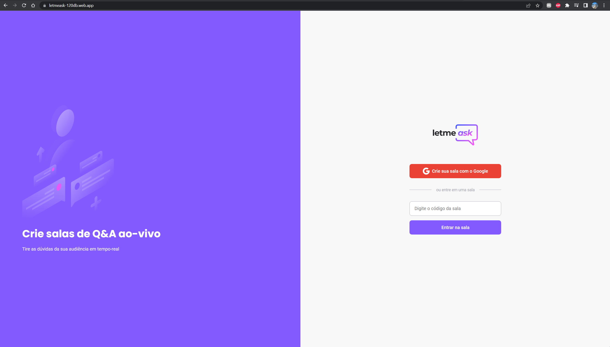
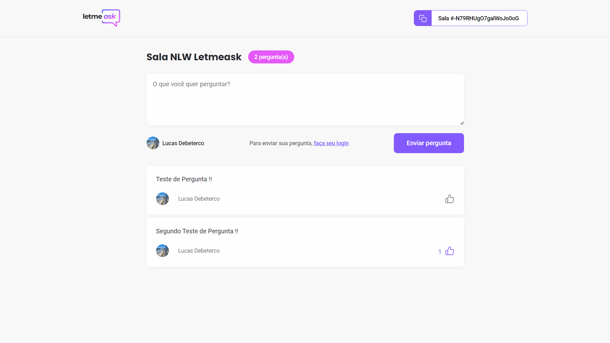

# Projeto Letmeask (nlw-together)

**https://letmeask-120db.web.app/**

* Projeto de uma aplicação em React/TypeScript, com objetivo do desenvolvimento de uma central de salas de perguntas,
onde usuários podem criar salas, compartilhar para outras pessoas e cadastrar suas dúvidas.
* Usuários admins podem dar "Highlight" em uma pergunta ou fechá-la quando estiver respondida.
* Toda a parte de persistência de dados e deploy foi feita utilizando as ferramentas do Firebase (Realtime Database e Firebase Hosting).
* <b>Proximos passos</b>: Responsividade completa, tema Dark, Styled Components, ESlint/Prettier.

 

Tela de inicial, onde é possível fazer a criação de uma sala (com autenticação por e-mail) ou entrar em uma sala já existente.
in pull request discussion.

  

 

Tela de visão da sala, onde é possível realizar perguntas ou vizualizar as perguntas já cadastradas..

  

